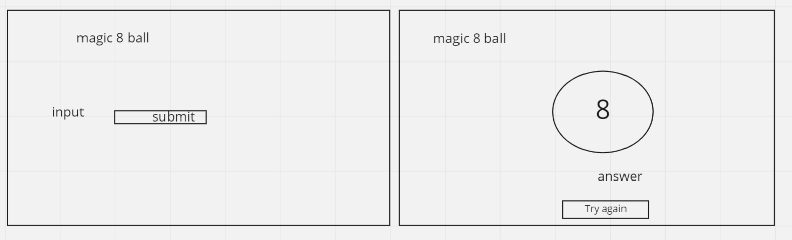

##HTML

-   h1
-   section
-   p for prompt
-   input tag for question
-   img of ball
-   p tag to display random answer
-   reset button

##events

-   hide text prompt then display image
-   make array and pick random number from array -1
-   set content of the answer p to random answer
-   hide the ball and the answer
-   show final prompt
